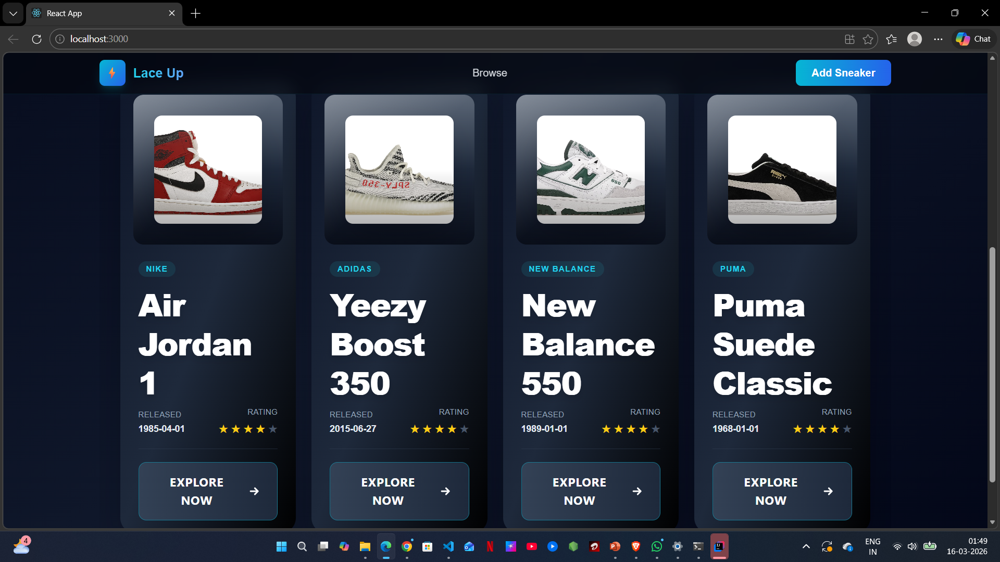
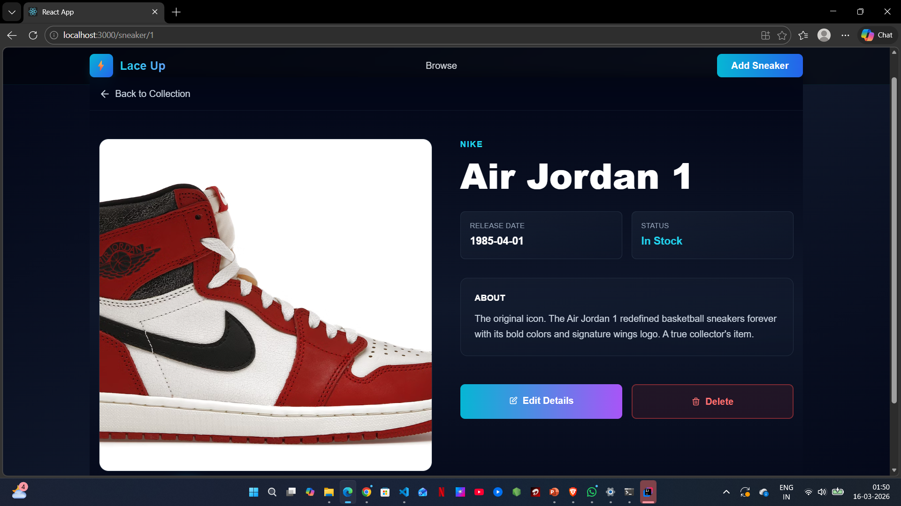

# LaceUp – Sneaker Review Platform

LaceUp is a full-stack web platform where users can explore, review, and rate sneakers.  
The application allows sneaker enthusiasts to share opinions, view community ratings, and discover popular sneaker models.

## Tech Stack

Frontend
- React.js

Backend
- Java Spring Boot

Database
- MySQL

## Features

- User authentication
- Add and view sneaker reviews
- Rating system for sneakers
- Store sneaker and review data using REST APIs
- Responsive UI for browsing sneakers

## Project Structure

PROJECT  
│  
├── lace-up-ui (React frontend)  
└── api (Spring Boot backend)

## Running the Project

### Start Backend

cd api/api  
.\mvnw spring-boot:run  

Backend runs on:  
http://localhost:8080

### Start Frontend

cd lace-up-ui  
npm install  
npm start  

Frontend runs on:  
http://localhost:3000

## Future Improvements

- User profiles
- Like and comment on reviews
- Sneaker recommendation system

## Screenshots
### Homepage

### Sneaker Listing

### Sneaker Details
